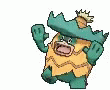

# Node + TypeScript + `node-llama-cpp` + Pokémon Data Fetcher

Este projeto utiliza **Node.js**, **TypeScript** e **`node-llama-cpp`** para buscar e traduzir dados de Pokémon. Ele se conecta à [PokéAPI](https://pokeapi.co/) para obter descrições dos Pokémon e usa `node-llama-cpp` para traduzir essas descrições para o português.

<p align="center">
  
</p>

## Funcionalidades

-   **Busca de Dados de Pokémon**: Obtém dados detalhados das espécies de Pokémon, incluindo descrições específicas das versões Sun e Moon.
-   **Tradução de Descrições**: Usa `node-llama-cpp` para traduzir as descrições das espécies para o português.
-   **Armazenamento de Resultados**: Salva dados como localização e outras informações em arquivos JSON.

## Pré-requisitos

Certifique-se de que possui os arquivos de modelo necessários para `node-llama-cpp`.

## Instalação

Instale os módulos do Node.js e baixe os arquivos de modelo necessários para `node-llama-cpp`:

```bash
npm install
```

Em seguida, baixe um modelo adequado para a sua máquina com o seguinte comando:

bash
Copiar código

```bash
  npx --no node-llama-cpp chat
```

Nota: O modelo recomendado para este projeto é o gemma-2-2b. Caso decida baixar um modelo diferente, será necessário atualizar a referência do modelo nesta constante:

```
const modelPath = await resolveModelFile(
    "nome do arquivo de modelo + extensão",
    modelsDirectory
);

```

Para iniciar o projeto e processar os dados dos Pokémon, execute:

```bash
npm start
```
